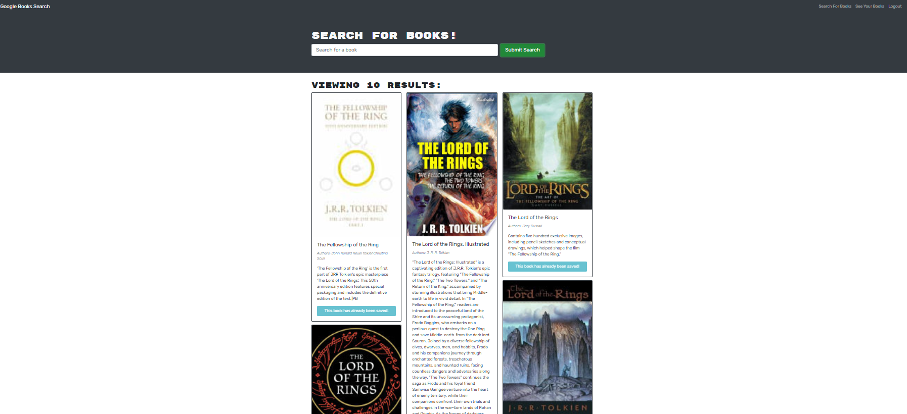

# Google booksearch App

## Description

This project challenged me to create a graphql and reac-app.

During this project I learned how to use:

- service workers to set up the app.
- create a manifest.json file
- css loaders and load the styles.
- create a client side and server side.
- enable an app to work offline
- use lighthouse to check for an app's performance.
- and indexedDB database.
- deploy an app on Render.

## Link to web app

https://my-pwa-app.onrender.com

## Installation

- clone the repository
- run npm install
- run npm start
- open the app on http://localhost:3000/

## Usage

This app provides an easy and accessible interface for a customer
to create and edit a text online and offline.

## Screenshot of website

## Credits: Resources used

I used and modified code from the following resources:

https://www.youtube.com/watch?v=4XT23X0Fjfk&list=PL4cUxeGkcC9gTxqJBcDmoi5Q2pzDusSL7

https://www.youtube.com/watch?v=yZ26CXny3iI

https://www.tutorialspoint.com/indexeddb/indexeddb_error_handling.htm

## License

MIT
